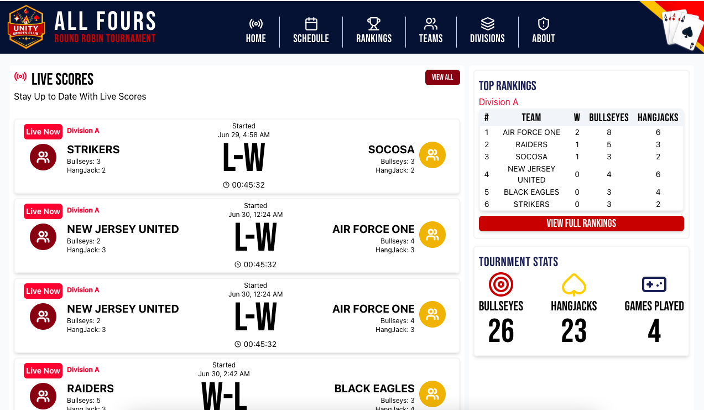
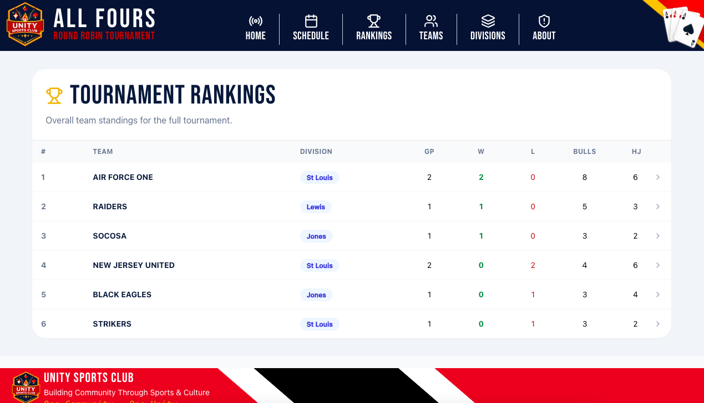
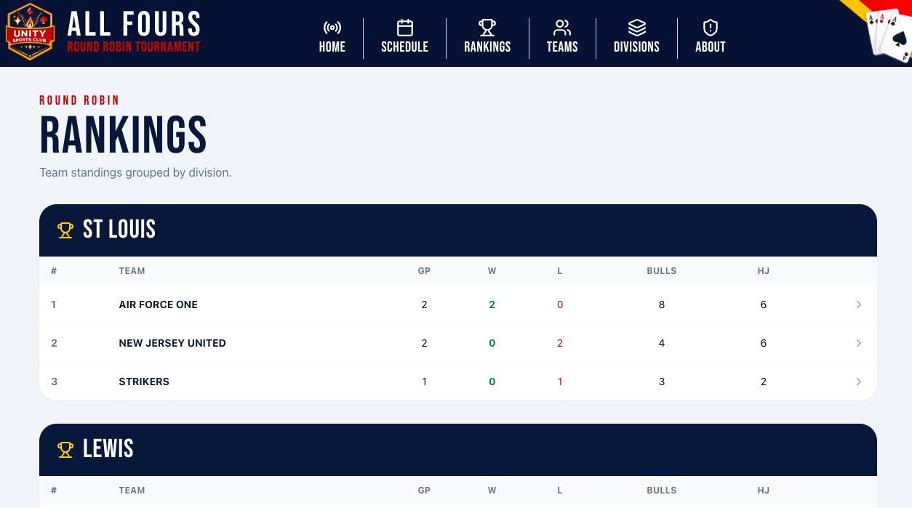
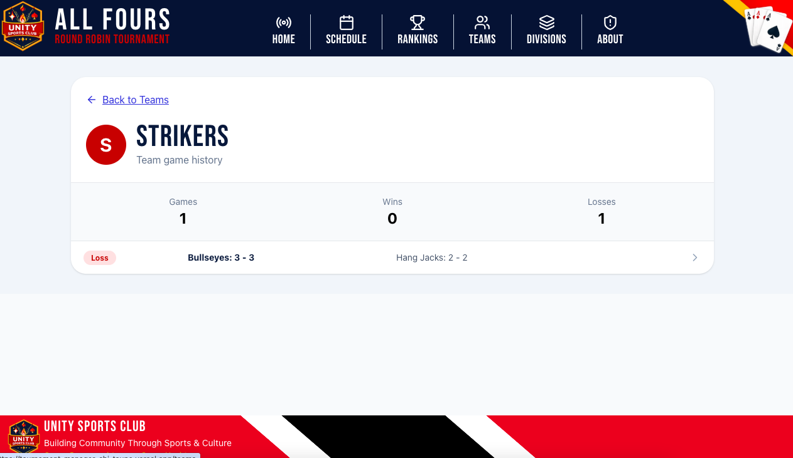
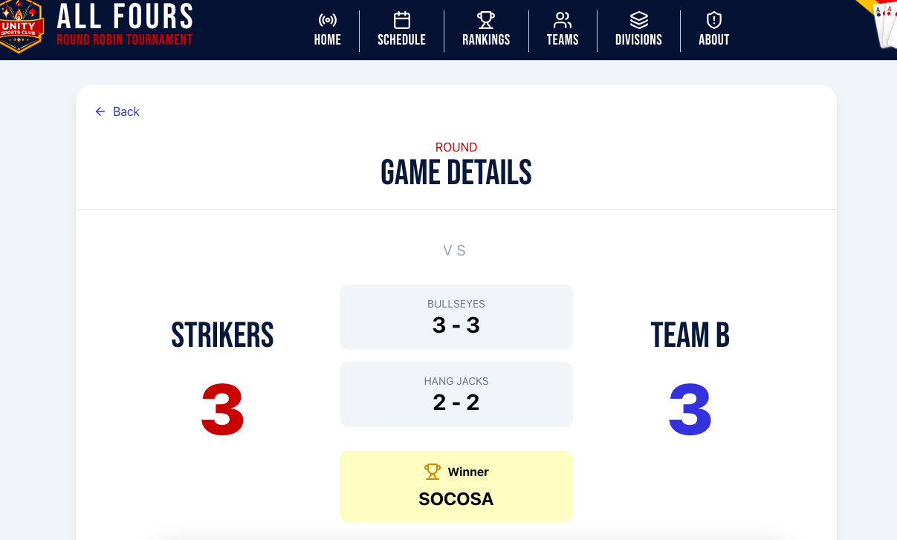
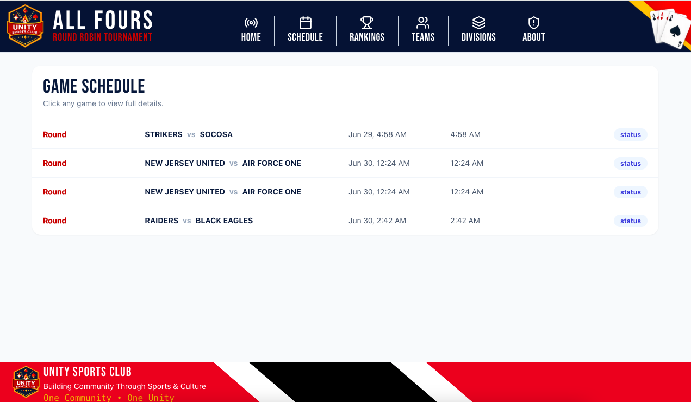

# Unity Sports Club Round Robin Tournament

> A modern tournament management platform built for the Unity Sports Club All Fours Round Robin Tournament.



## 🌐 Live Demo

**Live Site:** https://tournament-manager-chi-taupe.vercel.app/

---

## Overview

The Unity Sports Club Round Robin Tournament is one of the longest-running All Fours tournaments in the United States. Founded in **1980** by **Clarence Cooper** and the **Unity Sports Club** in Boston, Massachusetts, the tournament has brought together players from across New England, the United States, and the Caribbean for more than 45 years.

This application modernizes tournament management by replacing hard-coded data and manual tracking with a fully dynamic web application powered by React, TypeScript, PostgreSQL, and Supabase.

---

## Project History

This repository began as a fork of an earlier project created by my cousin, **Christian Cooper**.

The original project demonstrated tournament information using hard-coded data.

Since forking the project, I have redesigned and expanded it into a fully dynamic application by:

- Converting static data into a relational PostgreSQL database
- Integrating Supabase as the backend
- Designing a normalized database structure
- Creating SQL Views for tournament rankings and statistics
- Building responsive React pages
- Creating dynamic routing for teams, games, schedules, and standings
- Refactoring components to TypeScript
- Building reusable components throughout the application

The project continues to grow into a complete tournament management system.

---

# Features

## Tournament

- Live tournament standings
- Division standings
- Tournament statistics
- Game schedule
- Individual game pages
- Team pages
- Responsive mobile-first design

## Administration

- Create new games
- Dynamic score entry
- Automatic standings calculations
- Automatic tournament statistics

## Database

- Normalized PostgreSQL schema
- SQL Views for calculated standings
- Dynamic Supabase queries
- Relational data model

---

# Technology Stack

### Frontend

- React
- TypeScript
- Tailwind CSS
- React Router

### Backend

- Supabase
- PostgreSQL

### Development

- Git
- GitHub
- Vercel

---

# Screenshots

## Home Page


---

## Tournament Rankings



---

## Division Standings



---

## Team Page



---

## Game Details



---

## Schedule



---

# Database Architecture

```
Games
   │
   ▼
team_stats_from_games (View)
   │
   ▼
team_rankings (View)
   │
   ├──────────────► Tournament Rankings
   │
   ▼
division_rankings (View)
   │
   ▼
Division Standings
```

The application uses SQL Views to calculate tournament statistics rather than storing duplicate data, ensuring that standings always reflect the latest game results.

---

# Planned Features

- User authentication
- Administrator dashboard
- Player profiles
- Tournament history
- Team logos
- Search & filtering
- Multiple tournament support
- Live score updates
- Notifications
- Public API
- Advanced statistics
- Historical records

---

# Running Locally

Clone the repository:

```bash
git clone https://github.com/Sherweezy14/carribean-all-fours-scores.git
```

Install dependencies:

```bash
npm install
```

Start the development server:

```bash
npm start
```

---

# Environment Variables

Create a `.env` file:

```env
REACT_APP_SUPABASE_URL=your_supabase_url
REACT_APP_SUPABASE_ANON_KEY=your_supabase_key
```

---

# Author

## Sherwyn Cooper

Software Engineer

Built to preserve and modernize one of the oldest and most respected Caribbean All Fours tournaments in the United States.

---

### Acknowledgements

Special thanks to **Christian Rudder**, whose original project inspired this application. This project has since been redesigned and expanded into a fully dynamic tournament management platform.
